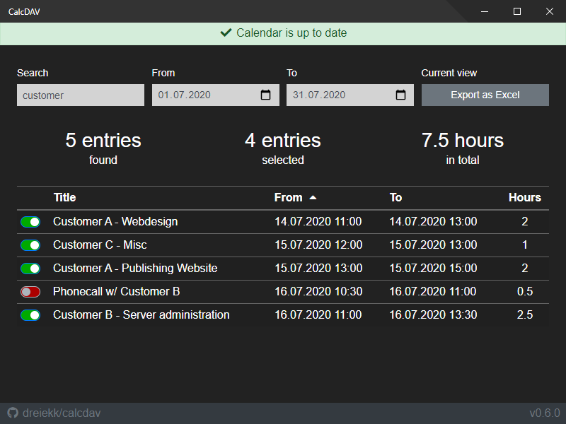

# calcdav

Simple caldav-client to sum up your project hours from a calendar. Built w/ [Electron](https://www.electronjs.org/), [VueJS](https://vuejs.org/) and [lambdabaa/dav](https://github.com/lambdabaa/dav).



### Features

- Multi-language (English, German)
- Export current view as Excel (*.xlsx)
- Auto Updater


## Download

Download the latest version [on the releases page](https://github.com/dreiekk/calcdav/releases).


## Developer setup

Make sure NodeJS 12.X and yarn are installed
```
node -v
yarn -v
```

Clone the repository
```
git clone https://github.com/dreiekk/calcdav
cd calcdav
```

Install the dependencies
```
yarn install
```

#### Compiles and hot-reloads for development
```
yarn electron:serve
```

#### Compiles and minifies for production
```
yarn electron:build
```

#### Lints and fixes files
```
yarn lint
```
